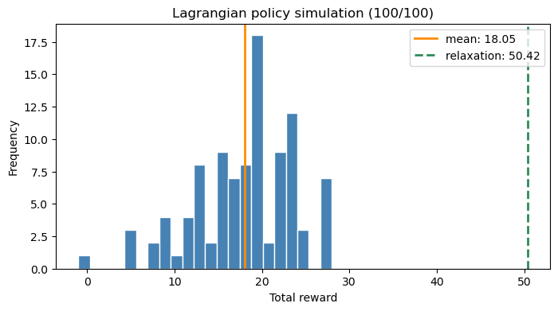

---
# How The Weakly Coupled MDP Code Works
---

This notebook is a guided tour of the weakly coupled MDP tutorial codebase. It is written for readers who want to understand the Python files, the basic function calls, and the baseline Lagrangian relaxation before moving to the self-adapting approximations.


---
## Table of Contents

1. [Big Picture](#big-picture)
2. [Imports and Project Root](#imports)
3. [Codebase Map](#file-map)
4. [WMDP Building Blocks](#building-blocks)
5. [Patient Outreach Example](#example)
6. [Baseline: Lagrangian Relaxation](#baseline)
7. [Where Self-Adaptation Enters](#self-adaptation)
8. [Reading Order](#reading-order)


---
<a id="big-picture"></a>
## 1. Big Picture

This project studies a finite-horizon weakly coupled MDP: several component MDPs evolve separately, while their actions are coupled by shared resource constraints.

The tutorial uses a preventive-care example. Each patient is one component. Each week, the decision maker chooses monitoring or nurse outreach for each patient, subject to nurse-time and physician-review budgets.

The three modeling layers are:

- `Lagrangian`: a baseline relaxation that enforces shared resources only in expectation.
- `FNR`: a feasible network relaxation that represents feasible joint actions with a compact layered network.
- `DelayedAllocationModel`: a self-adapting action-generation approach that starts with a restricted joint-action set and adds useful actions as needed.


---
<a id="imports"></a>
## 2. Imports and Project Root

The notebooks live in `notebooks/`, while the Python modules live one directory above. The setup cell finds the project root and adds it to `sys.path` so imports work from the notebook directory.


```python
import inspect
import sys
import time
from pathlib import Path

import matplotlib.pyplot as plt
import networkx as nx
from IPython.display import clear_output, display


def find_project_root(start_path: Path) -> Path:
    """Find the weakly-coupled MDP project root from a notebook directory."""
    for candidate in (start_path, *start_path.parents):
        if (candidate / "wmdp.py").exists() and (candidate / "fnr.py").exists():
            return candidate
    raise RuntimeError("Could not locate the weakly-coupled MDP project root.")


PROJECT_ROOT = find_project_root(Path.cwd().resolve())
if str(PROJECT_ROOT) not in sys.path:
    sys.path.insert(0, str(PROJECT_ROOT))

from wmdp import *
from fnr import *
from delayedallocation import *
from lagrangian import *
from simulator import Simulator

print("Project root:", PROJECT_ROOT)

```

    Project root: /Users/parshan/Library/CloudStorage/Dropbox/Parshan's Files/Github/INFORMS-Tutorials/weakly-coupled-mdp


---
<a id="file-map"></a>
## 3. Codebase Map

The project is intentionally small. Most of the logic lives in a handful of root Python files.


```python
print("Root Python modules:")
for path in sorted(PROJECT_ROOT.glob("*.py")):
    print("  ", path.name)

print("\nNotebook files:")
for path in sorted((PROJECT_ROOT / "notebooks").glob("*.ipynb")):
    print("  ", path.name)

```

    Root Python modules:
       delayedallocation.py
       fnr.py
       helper.py
       lagrangian.py
       policy.py
       simulator.py
       wmdp.py
    
    Notebook files:
       delayed-allocation-self-adaptation.ipynb
       fnr-self-adaptation.ipynb
       how-code-works.ipynb
       wmdp_fnr_tutorial.ipynb


The roles of the main files are:

| Path | Main role | Why it matters |
| --- | --- | --- |
| `wmdp.py` | component MDPs, linking constraints, and WMDP assembly | defines the core model objects used by every method |
| `lagrangian.py` | expectation-relaxed baseline and repaired sampling policy | gives a simple benchmark before self-adaptation |
| `fnr.py` | feasible network construction, visualization, LP model, and FNR policy | compactly represents feasible joint actions |
| `delayedallocation.py` | restricted action LP, separation, and refinement loop | adds useful joint actions only when needed |
| `policy.py` | shared policy interface | lets the simulator evaluate policies from different methods |
| `simulator.py` | sample-path simulation | compares executable policies after optimization |
| `helper.py` | notebook support layer | keeps repetitive tutorial code outside notebooks when needed |


---
<a id="building-blocks"></a>
## 4. WMDP Building Blocks

The central functions build component MDPs, build resource constraints, and assemble the full weakly coupled MDP.


```python
for obj in [build_component, build_linking_constraints, build_wmdp]:
    print(f"\n{obj.__name__}")
    print("  signature:", inspect.signature(obj))

```

    
    build_component
      signature: (component: int, actions: Sequence[int], state_data_by_period: Sequence[Sequence[Tuple[Hashable, Mapping[int, float]]]], transitions_by_period: Sequence[Mapping[Tuple[Hashable, int, Hashable], float]]) -> wmdp.StateSpaceComponent
    
    build_linking_constraints
      signature: (action_sets: Sequence[Sequence[int]], constraint_coefficients: Sequence[Mapping[Tuple[int, int], float]], rhs_values: Sequence[float]) -> wmdp.LinkingConstraints
    
    build_wmdp
      signature: (components: Sequence[wmdp.StateSpaceComponent], linking_constraints: wmdp.LinkingConstraints) -> wmdp.WMDP


A useful way to read the model objects is by responsibility:

- `StateComponent` stores one component state label and its action rewards.
- `StateSpace` stores the component MDPs and their action sets.
- `LinkingConstraints` checks whether a joint action satisfies shared resource limits.
- `WMDP` combines the component state space with the linking constraints.


```python
for cls in [StateComponent, StateSpace, LinkingConstraints, WMDP, Lagrangian, FNR, DelayedAllocationModel]:
    print(f"\n{cls.__name__}")
    print("  __init__ signature:", inspect.signature(cls.__init__))

```

    
    StateComponent
      __init__ signature: (self, label: Hashable, component: int, reward: Mapping[int, float]) -> None
    
    StateSpace
      __init__ signature: (self, J: int, T: int, S: Sequence[wmdp.StateSpaceComponent], A: Sequence[Sequence[int]]) -> None
    
    LinkingConstraints
      __init__ signature: (self, J: int, A: Sequence[Sequence[int]], K: int, C: Mapping[Tuple[int, int, int], float], b: Sequence[float]) -> None
    
    WMDP
      __init__ signature: (self, state_space: wmdp.StateSpace, linking_constraints: wmdp.LinkingConstraints) -> None
    
    Lagrangian
      __init__ signature: (self, wmdp: wmdp.WMDP, seed: int = 0, tolerance: float = 1e-09) -> None
    
    FNR
      __init__ signature: (self, wmdp: wmdp.WMDP, network: fnr.Network) -> None
    
    DelayedAllocationModel
      __init__ signature: (self, wmdp: wmdp.WMDP, initial_actions: Mapping[int, Sequence[Tuple[int, ...]]], tolerance: float = 1e-09) -> None


---
<a id="example"></a>
## 5. Patient Outreach Example

The next cells build the small five-patient WMDP used throughout the tutorial. These are the same ingredients used by the FNR and delayed-allocation notebooks.


## WMDP Example

We use a small <b>healthcare resource-allocation</b> example on preventive care. It is a stylized tutorial instance motivated by health monitoring and intervention problems, not a calibration to a specific clinical dataset.

A care-management team follows five patients over five weekly decision periods. Each week, the team decides which patients should receive nurse outreach, subject to shared limits on nurse time and physician review capacity.

<b>States</b>

Each patient starts in the `stable` state in period 0. From period 1 onward, each patient can be in one of two states:

- `stable`: the patient is clinically stable this week.
- `deteriorated`: the patient has deteriorated and needs recovery support.

The fixed all-stable initial state can still reach every later joint state: under monitoring, each stable patient independently remains stable with probability `0.8` or deteriorates with probability `0.2`.

The reward is a weekly outcome score. A positive score means a successful preventive week: a stable patient receives outreach and remains well supported. The preventive benefit differs by patient, with scores `[1, 1, 2, 4, 8]`. A score of `0.0` means a neutral or managed week. A score of `-1.0` means unmanaged deterioration: a deteriorated patient receives only monitoring.

<b>Actions</b>

For each patient and week, the decision maker chooses one of two actions:

- `0`: standard remote monitoring only. Vitals and symptoms are reviewed automatically, but no clinician outreach is scheduled.
- `1`: nurse outreach. A nurse calls the patient, reviews symptoms and vitals, reinforces the care plan, and escalates to physician review when needed.

<b>Linking Constraints</b>

The action is chosen separately for each patient, but the actions are coupled by shared weekly resource limits. Nurse outreach consumes two shared resources: nurse time and physician review capacity. Different patients require different amounts of these resources, so the intervention coefficients vary across patients.


## Constructing the WMDP

The next cells translate the patient-outreach story into the data structures used by the WMDP code: binary action sets, one component MDP per patient, and two linking constraints for the shared weekly resources.


### Action Set

The next code cell creates the same binary action set for all five patients. In the example, `0` means standard monitoring and `1` means nurse outreach.


```python
# J is the number of patient components and T is the number of weekly periods.
# Each patient has the same binary action set: 0 = monitoring, 1 = nurse outreach.
J = 5
T = 5
action_sets = [[0, 1] for _ in range(J)]

print("Action sets:")
action_sets
```

    Action sets:


    [[0, 1], [0, 1], [0, 1], [0, 1], [0, 1]]


### Component MDPs

The next code cell builds the patient-level MDPs. All patients start `stable` in period 0, and each later period has both possible patient states. The transition model is shared across patients, while the preventive outreach reward varies by patient.


```python
# Patient-specific preventive outcome scores for nurse outreach in the stable state.
# Later patients have higher preventive benefit, which makes resource allocation more consequential.
stable_outreach_reward = [1.0, 1.0, 2.0, 4.0, 8.0]

# Each transition key is (current_state, action, next_state), and the value is the transition probability.
# For example, the first line means that a stable patient who receives only monitoring
# remains stable next week with probability 0.8.
transition_kernel = {
    ("stable", 0, "stable"): 0.8,
    ("stable", 0, "deteriorated"): 0.2,
    ("stable", 1, "stable"): 1.0,
    ("deteriorated", 0, "deteriorated"): 1.0,
    ("deteriorated", 1, "stable"): 0.7,
    ("deteriorated", 1, "deteriorated"): 0.3,
}

# Build one component MDP for each patient.
# Period 0 contains only the fixed initial state; later periods contain all reachable states.
components = []
for j in range(J):
    state_reward_by_period = [
        [("stable", {0: 0.0, 1: stable_outreach_reward[j]})],
    ] + [
        [
            ("stable", {0: 0.0, 1: stable_outreach_reward[j]}),
            ("deteriorated", {0: -1.0, 1: 0.0}),
        ]
        for _ in range(T - 1)
    ]

    component = build_component(
        component=j,
        actions=action_sets[j],
        state_data_by_period=state_reward_by_period,
        transitions_by_period=[transition_kernel.copy() for _ in range(len(state_reward_by_period) - 1)],
    )
    components.append(component)

# Example: printing the first patient component
print("Component 0, period-0 states:")
print(components[0].states[0])
print()
print("Component 0 transition kernel for period 0:")
print(components[0].P[0])
```

    Component 0, period-0 states:
    [(stable,0,{0: 0.0, 1: 1.0})]
    
    Component 0 transition kernel for period 0:
    {('stable', 0, 'stable'): 0.8, ('stable', 0, 'deteriorated'): 0.2, ('stable', 1, 'stable'): 1.0, ('deteriorated', 0, 'deteriorated'): 1.0, ('deteriorated', 1, 'stable'): 0.7, ('deteriorated', 1, 'deteriorated'): 0.3}


### Linking Constraints

The next code cell adds the weekly resource limits. The first coefficient dictionary is nurse time and the second is physician review capacity. Action `0` has omitted coefficients, so it consumes zero resources; action `1` consumes patient-specific amounts.

The nurse-time budget is

$$
3 \times \mathbf{1}\{a_0 = 1\} + 3 \times \mathbf{1}\{a_1 = 1\} + 8 \times \mathbf{1}\{a_2 = 1\} + 8 \times \mathbf{1}\{a_3 = 1\} + 8 \times \mathbf{1}\{a_4 = 1\} \leq 14.
$$

The physician-review budget is

$$
5 \times \mathbf{1}\{a_0 = 1\} + 5 \times \mathbf{1}\{a_1 = 1\} + 13 \times \mathbf{1}\{a_2 = 1\} + 13 \times \mathbf{1}\{a_3 = 1\} + 13 \times \mathbf{1}\{a_4 = 1\} \leq 23.
$$


```python
# Each resource dictionary is keyed by (patient_index, action).
# Only action 1 appears because monitoring consumes zero outreach resources by default.

# For example, nurse_time[(0, 1)] = 3.0 means outreach for patient 0 uses 3 units of nurse time.
# Similarly, physician_review[(0, 1)] = 5.0 means outreach for patient 0 uses 5 units of physician-review capacity.
nurse_time = {
    (0, 1): 3.0,
    (1, 1): 3.0,
    (2, 1): 8.0,
    (3, 1): 8.0,
    (4, 1): 8.0,
}
physician_review = {
    (0, 1): 5.0,
    (1, 1): 5.0,
    (2, 1): 13.0,
    (3, 1): 13.0,
    (4, 1): 13.0,
}

# The two right-hand sides are the weekly nurse-time and physician-review budgets.
linking_constraints = build_linking_constraints(
    action_sets=action_sets,
    constraint_coefficients=[nurse_time, physician_review],
    rhs_values=[14.0, 23.0],
)

print("Linking constraints:")
print(linking_constraints)
```

    Linking constraints:
    + 3.0 * y_{0,0,1} + 3.0 * y_{0,1,1} + 8.0 * y_{0,2,1} + 8.0 * y_{0,3,1} + 8.0 * y_{0,4,1} <= 14.0
    + 5.0 * y_{1,0,1} + 5.0 * y_{1,1,1} + 13.0 * y_{1,2,1} + 13.0 * y_{1,3,1} + 13.0 * y_{1,4,1} <= 23.0


### Assembling the WMDP

The next code cell combines the five patient MDPs with the shared resource constraints. The period-0 joint state is now fixed to all patients stable; later periods contain the full reachable state space.


```python
# Combine the patient component MDPs and the shared resource constraints into one WMDP.
wmdp = build_wmdp(
    components=components,
    linking_constraints=linking_constraints,
)

print(wmdp)

```

    WMDP(J=5, T=5, num_constraints=2)


### The WMDP size

If enumerating states and actions for a classical dynamic programming forward/backward recursion, or to construct an exact linear program, what would be the size of the state and action spaces?


```python
# Count the joint states and joint actions that an exact dynamic program or exact LP would enumerate.
state_counts_by_period = {
    t: len(wmdp.generate_states(t))
    for t in range(wmdp.T)
}

# The feasible joint action space keeps only outreach plans satisfying the two resource budgets.
feasible_actions = [
    tuple(action)
    for action, _ in wmdp.generate_feasible_actions()
]
feasible_action_count = len(feasible_actions)

# An exact recursion or exact LP would consider every feasible action in every joint state.
state_action_counts_by_period = {
    t: state_counts_by_period[t] * feasible_action_count
    for t in range(0, wmdp.T)
}

total_joint_states = sum(state_counts_by_period.values())
total_state_action_pairs = sum(state_action_counts_by_period.values())

print("Exact state-action enumeration using feasible actions:")
for t, count in state_action_counts_by_period.items():
    print(f"  period {t}: {state_counts_by_period[t]} states x {feasible_action_count} actions = {count}")
print(f"Total state-action pairs across {wmdp.T} periods: {total_state_action_pairs}")
print()
```

    Exact state-action enumeration using feasible actions:
      period 0: 1 states x 16 actions = 16
      period 1: 32 states x 16 actions = 512
      period 2: 32 states x 16 actions = 512
      period 3: 32 states x 16 actions = 512
      period 4: 32 states x 16 actions = 512
    Total state-action pairs across 5 periods: 2064
    


---
<a id="baseline"></a>
## 6. Baseline: Lagrangian Relaxation

The Lagrangian relaxation is the gateway baseline. It keeps component-level marginal flows and enforces the shared resource constraints only in expectation. The extracted policy is repaired online so the simulated actions remain feasible.


## The baseline: Lagrangian relaxation

As a baseline, we solve a relaxation that enforces the nurse-time and physician-review constraints only in expectation. The resulting marginal flows are easy to compute, but the sampled policy still has to be repaired online to return a feasible weekly outreach plan.


### <b>Construct</b>: Building the Lagrangian Relaxation

The next code cell constructs the expectation-relaxed model for the same patient-outreach WMDP. It uses patient-level marginal flow variables and replaces pathwise feasibility with expected resource-use constraints in each period.


```python
# Construct the expectation-relaxed Lagrangian model.
# The model keeps component-level marginal flows and enforces resources only in expectation.
lagrangian_model = Lagrangian(wmdp)

```

    Set parameter Username


    Set parameter LicenseID to value 2809918


    Academic license - for non-commercial use only - expires 2027-04-17


### <b>Optimize</b>: Solving the Lagrangian Relaxation

The next code cell solves the relaxed LP and extracts a sampling policy. The reported objective is the relaxation value; the policy simulation below measures the feasible repaired policy that is actually executed.


```python
# Solve the Lagrangian relaxation and inspect expected resource use by period and constraint.
lagrangian_result = lagrangian_model.optimize()

print("Objective value: ", lagrangian_result.objective_value)

print("\nExpected resource use:")
for (period, constraint), value in lagrangian_result.expected_resource_use.items():
    budget = wmdp.linking_constraints.b[constraint]
    print(f"  period {period}, constraint {constraint}: {value:.3f} / {budget:.3f}")

```

    Optimizing...
    	done.
    Lagrangian model size: vars=90 constrs=55 nonzeros=285 time=0.00043392181396484375s
    Objective value:  50.41569999999999
    
    Expected resource use:
      period 0, constraint 0: 14.000 / 14.000
      period 0, constraint 1: 22.750 / 23.000
      period 1, constraint 0: 14.000 / 14.000
      period 1, constraint 1: 22.800 / 23.000
      period 2, constraint 0: 14.000 / 14.000
      period 2, constraint 1: 22.805 / 23.000
      period 3, constraint 0: 14.000 / 14.000
      period 3, constraint 1: 22.805 / 23.000
      period 4, constraint 0: 14.000 / 14.000
      period 4, constraint 1: 22.750 / 23.000


### Simulating the Lagrangian Policy

The next code cell simulates the feasible policy induced by the Lagrangian marginals. At each state, the policy samples patient actions one at a time from the marginal probabilities; if a sampled outreach action would violate the original resource constraints, it uses monitoring action `0` for that patient.


```python
# Simulate the repaired Lagrangian policy and plot total realized outcome scores.
num_simulations = 100
lagrangian_simulator = Simulator(wmdp, lagrangian_result.policy)
lagrangian_total_rewards = []

fig, ax = plt.subplots(figsize=(8, 4))

for simulation_index in range(num_simulations):
    simulation_result = lagrangian_simulator.simulate()
    lagrangian_total_rewards.append(simulation_result["total_reward"])

    ax.clear()
    ax.hist(
        lagrangian_total_rewards,
        bins=min(30, max(1, len(set(lagrangian_total_rewards)))),
        color="steelblue",
        edgecolor="white",
    )
    sample_mean = sum(lagrangian_total_rewards) / len(lagrangian_total_rewards)
    ax.axvline(
        sample_mean,
        color="darkorange",
        linewidth=2,
        label=f"mean: {sample_mean:.2f}",
    )
    ax.axvline(
        lagrangian_result.objective_value,
        color="seagreen",
        linewidth=2,
        linestyle="--",
        label=f"relaxation: {lagrangian_result.objective_value:.2f}",
    )
    ax.set_title(f"Lagrangian policy simulation ({simulation_index + 1}/{num_simulations})")
    ax.set_xlabel("Total reward")
    ax.set_ylabel("Frequency")
    ax.legend(loc="upper right")

    clear_output(wait=True)
    display(fig)
    time.sleep(0.05)

# clear_output(wait=True)
# display(fig)
print(f"Mean total reward over {num_simulations} simulations: {sum(lagrangian_total_rewards) / len(lagrangian_total_rewards):.3f}")

```


    

    


    Mean total reward over 100 simulations: 18.050


    

    


---
<a id="self-adaptation"></a>
## 7. Where Self-Adaptation Enters

The baseline separates the patient MDPs and handles shared resources in expectation. The next two notebooks improve on that baseline by adapting the representation of feasible joint actions.

- [`fnr-self-adaptation.ipynb`](fnr-self-adaptation.ipynb) builds a feasible network relaxation and compares its policy value against the Lagrangian baseline.
- [`delayed-allocation-self-adaptation.ipynb`](delayed-allocation-self-adaptation.ipynb) starts with a restricted action set and refines it by adding useful feasible outreach plans.

In both cases, the value of self-adaptation is measured relative to the same Lagrangian baseline from this notebook.


---
<a id="reading-order"></a>
## 8. Reading Order

A practical reading order is:

1. [how-code-works.ipynb]([weakly-coupled-mdp/notebooks/](https://github.com/Self-Adapting-MDP-Approximations/INFORMS-Tutorial/blob/main/weakly-coupled-mdp/notebooks/)how-code-works.ipynb)
   Learn the files, data structures, basic function calls, and Lagrangian baseline.
2. [fnr-self-adaptation.ipynb]([weakly-coupled-mdp/notebooks/](https://github.com/Self-Adapting-MDP-Approximations/INFORMS-Tutorial/blob/main/weakly-coupled-mdp/notebooks/)fnr-self-adaptation.ipynb)
   See how a feasible network represents joint actions and improves the executable policy.
3. [delayed-allocation-self-adaptation.ipynb](https://github.com/Self-Adapting-MDP-Approximations/INFORMS-Tutorial/blob/main/weakly-coupled-mdp/notebooks/delayed-allocation-self-adaptation.ipynb)
   See how refinement adds useful joint actions without starting from the full feasible-action representation.

